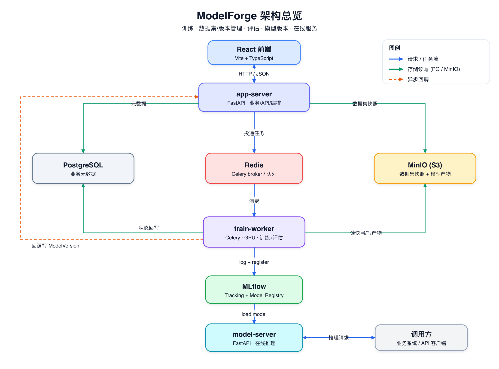

# ModelForge

小团队内部使用的 **NLP 模型训练与服务平台**,围绕 BERT 架构类编码器模型(**不做大模型微调,不做图像**)。提供训练集/评估集管理与版本管理、训练流程、评估流程、模型版本管理,以及在线推理部署。



## 功能

- **数据集管理 + 版本管理**:训练集 / 评估集统一管理,每次提交生成不可变全量快照(parquet)落对象存储,带 checksum,保证训练可复现。
- **训练流程**:按 `task_type` 分流 recipe(分类已落地;NER / 句对 / embedding 微调规划中),实验与产物记录到 MLflow。
- **评估流程**:在 worker 内对评估集批量推理算指标(规划中,见 [路线图](#路线图))。
- **模型版本管理**:复用 MLflow Model Registry,业务侧 `ModelVersion` 表镜像关键字段供查询与评估关联。
- **在线部署**:model-server 从 Registry 拉权重提供推理 API(规划中)。

支持的任务类型:

| task_type | 说明 | 训练方式 | 评估指标 |
|---|---|---|---|
| `classification` | 单/多标签文本分类、意图、情感 | HF `Trainer` | accuracy / precision / recall / F1 |
| `ner` | 序列标注 / 实体识别 | HF `Trainer` | entity-level F1 |
| `pair` | 句对 / 语义相似度 | HF `Trainer` / CoSENT | Spearman / Pearson |
| `embedding` | 检索向量模型微调(BGE / m3e / gte) | sentence-transformers / FlagEmbedding | recall@k / MRR / nDCG |

> 当前仓库已落地 `classification` 全链路;其余 task_type 与在线部署见路线图。

## 架构

四个组件 + 基础设施,职责单一、边界清晰:

| 组件 | 技术栈 | 职责 | 不负责 |
|---|---|---|---|
| **app-server** | FastAPI + SQLAlchemy + Alembic | 认证、CRUD、版本管理、任务编排、对前端 API | 不跑训练/推理 |
| **train-worker** | Celery + HuggingFace + sentence-transformers | 离线批处理:训练 + 评估(GPU) | 不对外提供 HTTP |
| **model-server** | FastAPI + transformers | 在线推理服务 | 不做训练/评估 |
| **前端** | React + TypeScript + Vite | 数据集 / 训练 / 模型版本页面 | — |
| 基础设施 | PostgreSQL / Redis / MinIO / MLflow | 元数据 / 队列 / 对象存储 / 实验与注册表 | — |

**服务解耦**:app-server 与 train-worker 互不 import 代码,仅通过 PostgreSQL + 共享的 Celery 任务名(`services/common`)耦合;app-server 用 `send_task(name)` 投递,worker 完成后写 PG 状态并 HTTP 回调 app-server 创建 `ModelVersion`。

详见架构设计文档:[`docs/superpowers/specs/2026-06-13-modelforge-architecture-design.md`](docs/superpowers/specs/2026-06-13-modelforge-architecture-design.md)。

## 目录结构

```
ModelForge/
├── docker-compose.yml            # PG / Redis / MinIO / MLflow
├── .env.example                  # 环境变量示例
├── images/architecture.png       # 架构图
├── services/
│   ├── common/                   # 共享枚举(TaskType/JobStatus/DatasetKind)+ 任务名常量
│   ├── app-server/               # FastAPI 业务服务 + Alembic 迁移
│   ├── train-worker/             # Celery worker + 训练 recipe
│   └── model-server/             # 在线推理服务(健康检查骨架)
├── frontend/                     # React + TS + Vite
└── docs/superpowers/             # 架构 spec 与实现计划
```

## 关键工作流

**训练**:前端选 数据集版本 + base_model + 超参 → app-server 建 `TrainingJob` 并投 Celery → worker 拉快照、按 `task_type` 跑 recipe、metrics/产物写 MLflow 并 `register_model` → 回写状态 + 回调创建 `ModelVersion`。

**数据集版本**:上传 CSV/JSONL → 按 task_type 校验 schema → 全量快照写 MinIO(parquet + sha256)→ `DatasetVersion` 自增版本号入库。

## 快速开始

### 1. 启动基础设施

```bash
cp .env.example .env
docker compose up -d                      # PG / Redis / MinIO / MLflow
# 首次创建 MinIO bucket
docker compose exec minio mc alias set local http://localhost:9000 minioadmin minioadmin
docker compose exec minio mc mb -p local/datasets local/mlflow
```

### 2. 安装依赖(建议用一个虚拟环境)

```bash
pip install -e services/common              # 先装共享包(非 PyPI)
pip install -e 'services/app-server[dev]'
pip install -e 'services/train-worker[dev]' # 含 torch/transformers,首次较慢
pip install -e 'services/model-server[dev]'
```

### 3. 初始化数据库

```bash
cd services/app-server && alembic upgrade head && cd -
```

### 4. 启动服务

```bash
# app-server
cd services/app-server && uvicorn app.main:app --port 8000 &

# train-worker(默认 MinIO 凭证开箱即用)
cd services/train-worker && celery -A worker.celery_app worker -c 1 -l info &

# 前端
cd frontend && npm install && npm run dev
```

> **关于 MLflow 访问 MinIO 的凭证**:MLflow 上传模型产物到 MinIO 的 `mlflow` 桶时,走的是 AWS SDK 标准变量(`AWS_ACCESS_KEY_ID` / `AWS_SECRET_ACCESS_KEY` / `MLFLOW_S3_ENDPOINT_URL`),与平台自有的 `S3_ACCESS_KEY`/`S3_SECRET_KEY`(访问 `datasets` 桶)是两套通道。worker 已在 `worker/mlflow_utils.py` 里**从自身配置显式设置**这些变量,因此无需手动 export;改用自定义凭证时,设置 worker 的 `S3_ACCESS_KEY`/`S3_SECRET_KEY`/`S3_ENDPOINT_URL`(环境变量或 `.env`)即可。

## 端到端冒烟

参见 [`services/app-server/tests/test_e2e_smoke.md`](services/app-server/tests/test_e2e_smoke.md):建分类数据集 → 上传 CSV → 提交训练 → 轮询至 `succeeded` → `/model-versions` 出现新版本 → MLflow UI(`:5000`)可见 run 与注册模型。

## 测试

```bash
cd services/common       && pytest -q
cd services/app-server   && pytest -q
cd services/train-worker && pytest -q -m "not slow"   # 跳过真实训练
cd services/train-worker && pytest -q -m slow         # 真实训练 bert-tiny(需联网,~30s)
cd services/model-server && pytest -q
```

## 主要 API

| 方法 | 路径 | 说明 |
|---|---|---|
| `POST` | `/datasets` | 创建数据集 |
| `GET` | `/datasets` | 数据集列表 |
| `POST` | `/datasets/{id}/versions` | 上传 CSV/JSONL 生成新版本 |
| `GET` | `/datasets/{id}/versions` | 版本列表 |
| `POST` | `/training-jobs` | 提交训练任务 |
| `GET` | `/training-jobs/{id}` | 查询任务状态 |
| `GET` | `/model-versions` | 模型版本列表 |

## 路线图

已完成(基础地基,phases 1–3):基础设施 + 三服务骨架、数据集与版本管理、classification 训练全链路(训练 → MLflow 注册 → 模型版本)。

待实现:

- 评估流程执行(worker 内批量推理 + 指标 + Leaderboard)
- `ner` / `pair` / `embedding` recipe(embedding 含难负样本挖掘)
- model-server 在线部署(`/predict` `/embed` `/similarity` + 部署管理)

详见实现计划:[`docs/superpowers/plans/2026-06-13-modelforge-foundation.md`](docs/superpowers/plans/2026-06-13-modelforge-foundation.md)。
