# ModelForge

小团队内部使用的 **NLP 模型训练与服务平台**,围绕 BERT 架构类编码器模型(**不做大模型微调,不做图像**)。提供训练集/评估集管理与版本管理、训练流程、评估流程、模型版本管理,以及在线推理部署。


## 功能

- **数据集管理 + 版本管理**:训练集 / 评估集统一管理,每次提交生成不可变全量快照(parquet)落对象存储,带 checksum,保证训练可复现。支持 **CSV / JSONL / Excel(xlsx)** 导入,并可按任务类型一键下载对应格式的**数据模板**。
- **训练流程**:按 `task_type` 分流 recipe(classification / ner / pair / embedding 均已落地),实验与产物记录到 MLflow。提交时先选基础模型(BERT / BGE / GTE 分组目录),数据集**联动级联**只显示格式匹配的版本。训练中有**实时进度条**,并可深链到 MLflow 看逐步 loss 曲线。
- **评估流程**:对某模型版本 + 评估集版本发起评估,worker 加载已注册模型批量推理算指标,结果回写 `EvalRun`,可在同一评估集上横向对比多个模型版本。
- **模型版本管理**:复用 MLflow Model Registry,业务侧 `ModelVersion` 表镜像关键字段供查询与评估关联;支持手动**提升生命周期阶段**(未发布 / 预发布 / 生产 / 已归档,需 `model:write`)。
- **在线部署**:一键把模型版本部署到 model-server,从 Registry 拉权重加载,按 task_type 暴露 `/predict`(分类/NER)、`/embed`(向量)、`/similarity`(句对);app-server 提供部署管理(创建 / 列表 / 停止 / **重新启动**),前端可查看每个模型的 **API 详情(curl + 输入输出说明)**。推理接口输出统一 `{code, data, message}` 信封。
- **认证与 RBAC**:JWT 登录 + 自定义角色(固定权限目录上自由组合)+ 角色级数据范围(`all`/`own`,`own` 仅见/改自己 `created_by` 的资源);超管管理用户(角色/启停/改密)与角色(权限集/数据范围);内部回调用 `X-Internal-Token` 护栏。

支持的任务类型:

| task_type | 说明 | 训练方式 | 评估指标 |
|---|---|---|---|
| `classification` | 单/多标签文本分类、意图、情感 | HF `Trainer` | accuracy / precision / recall / F1 |
| `ner` | 序列标注 / 实体识别 | HF `Trainer` | entity-level F1 |
| `pair` | 句对 / 语义相似度 | HF `Trainer` / CoSENT | Spearman / Pearson |
| `embedding` | 检索向量模型微调(BGE / m3e / gte) | sentence-transformers / FlagEmbedding | recall@k / MRR / nDCG |

> 四类 task_type 的训练 recipe、评估器与在线部署均已落地。

## 界面预览

### 总览仪表盘

按权限/数据范围聚合的核心指标与报表(数据集、模型、训练、部署、测试)。

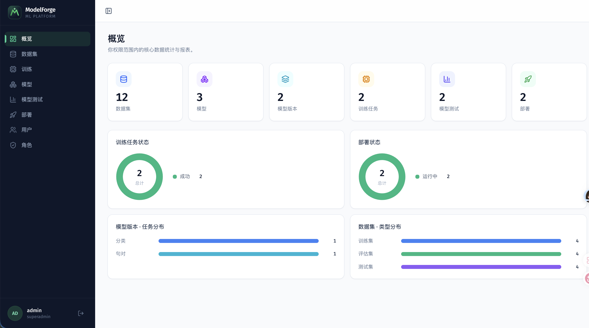

### 数据集与版本

| 数据集列表 | 上传新版本 |
|---|---|
| 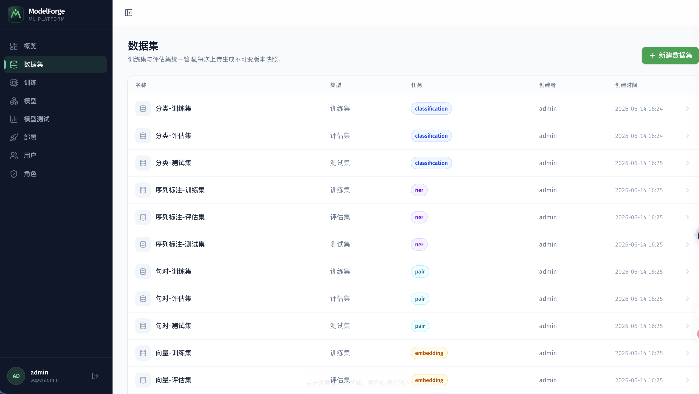 | 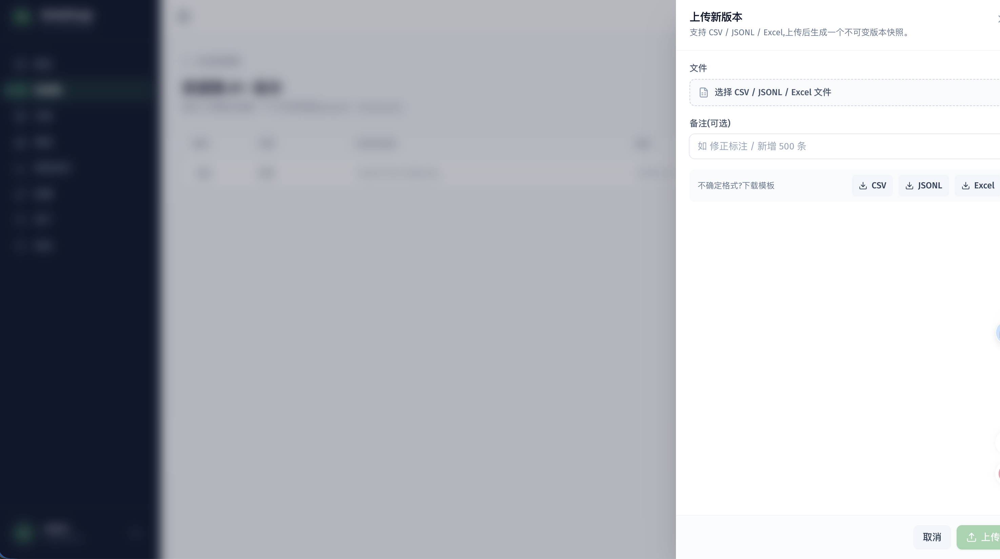 |

### 模型与训练

| 模型列表 | 新建模型 |
|---|---|
| 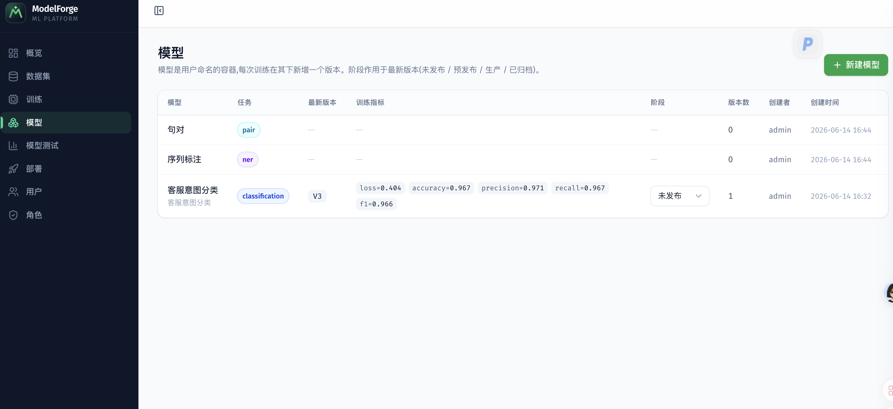 | 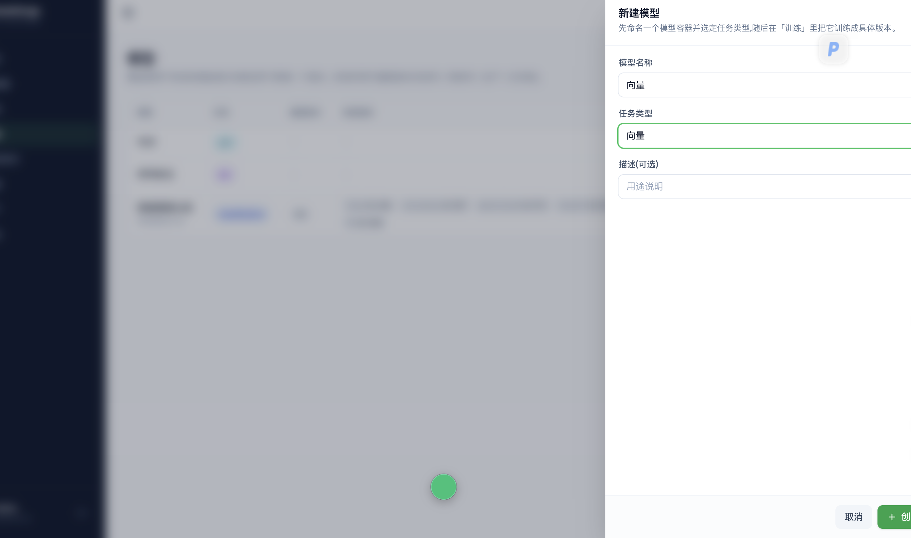 |

| 新建训练(级联选择数据集/评估集) | 训练列表(实时进度 + MLflow 深链) |
|---|---|
| 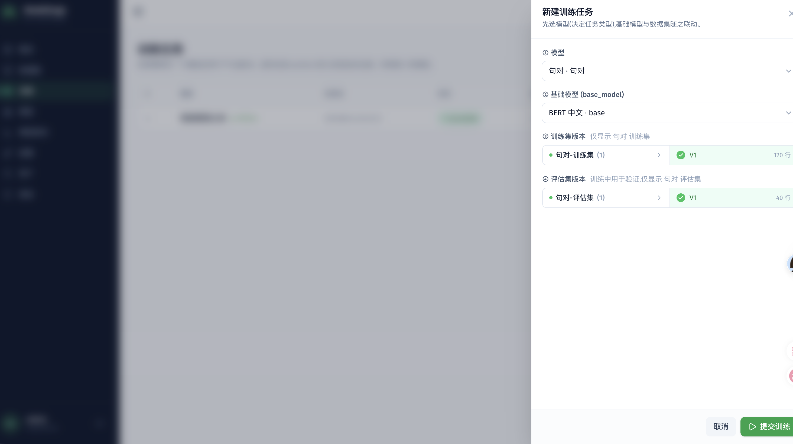 | 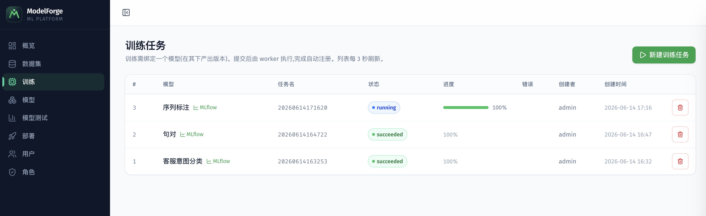 |

### 模型测试(评估)

| 发起测试 | 测试列表 / Leaderboard |
|---|---|
| 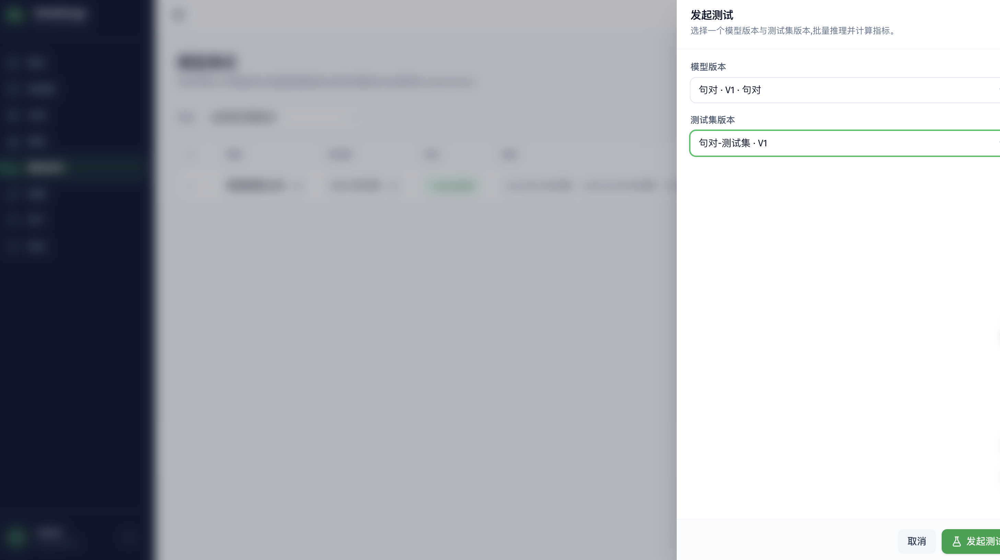 | 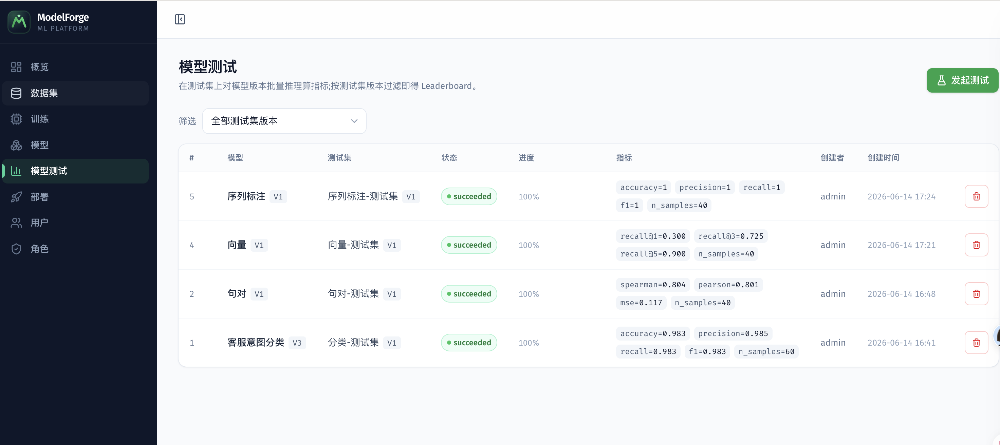 |

### 在线部署与 API

| 新建部署 | 部署列表 |
|---|---|
|  | 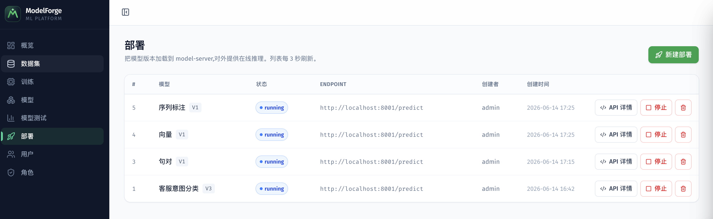 |

每个部署可查看 **API 详情**(接口、cURL 示例、输入输出说明)并直接在线调用:


| 调用示例 ① | 调用示例 ② | 调用示例 ③ |
|---|---|---|
|  |  |  |

### 用户与角色(RBAC)

| 用户列表 | 新建用户 |
|---|---|
| 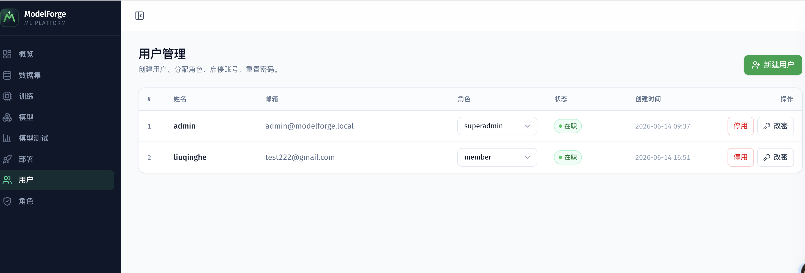 | 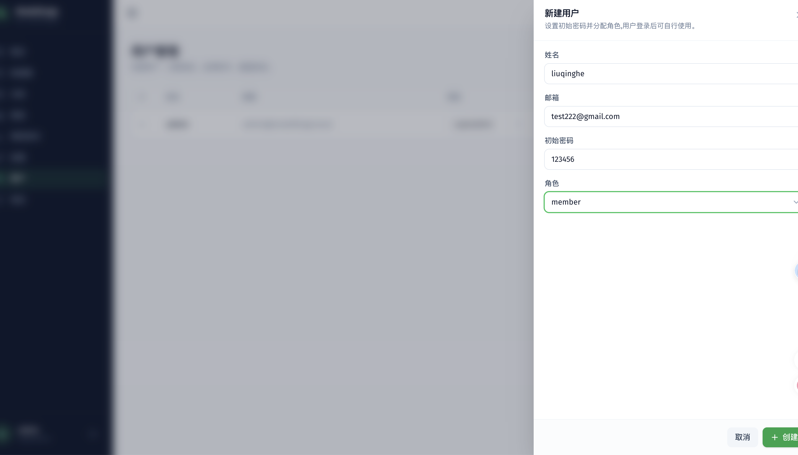 |

| 角色列表 | 新建/编辑角色(权限自由组合 + 数据范围) |
|---|---|
| 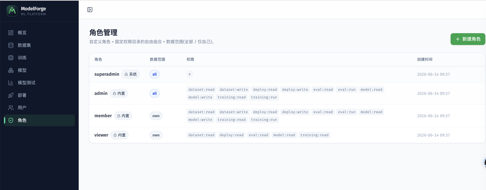 | 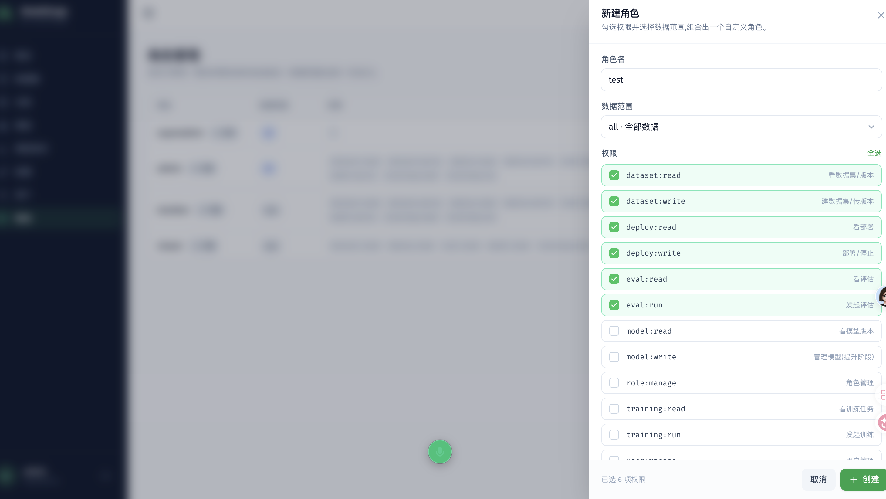 |

## 架构

四个组件 + 基础设施,职责单一、边界清晰:

| 组件 | 技术栈 | 职责 | 不负责 |
|---|---|---|---|
| **app-server** | FastAPI + SQLAlchemy + 编号 SQL 迁移 | 认证、CRUD、版本管理、任务编排、对前端 API | 不跑训练/推理 |
| **train-worker** | Celery + HuggingFace + sentence-transformers | 离线批处理:训练 + 评估(GPU) | 不对外提供 HTTP |
| **model-server** | FastAPI + transformers | 在线推理服务 | 不做训练/评估 |
| **前端** | React + TypeScript + Vite | 数据集 / 训练 / 模型版本页面 | — |
| 基础设施 | PostgreSQL / Redis / MinIO / MLflow | 元数据 / 队列 / 对象存储 / 实验与注册表 | — |

**服务解耦**:app-server 与 train-worker 互不 import 代码,仅通过 PostgreSQL + 共享的 Celery 任务名(`services/common`)耦合;app-server 用 `send_task(name)` 投递,worker 完成后写 PG 状态并 HTTP 回调 app-server 创建 `ModelVersion`。

详见架构设计文档:[`docs/superpowers/specs/2026-06-13-modelforge-architecture-design.md`](docs/superpowers/specs/2026-06-13-modelforge-architecture-design.md)。

## 目录结构

```
ModelForge/
├── docker-compose.yml            # PG / Redis / MinIO / MLflow
├── .env.example                  # 环境变量示例
├── images/                       # 架构图 + 各功能界面截图
├── services/
│   ├── common/                   # 共享枚举(TaskType/JobStatus/DatasetKind)+ 任务名常量
│   ├── app-server/               # FastAPI 业务服务 + db/migrations/ 编号 SQL 迁移
│   ├── train-worker/             # Celery worker + 训练 recipe
│   └── model-server/             # 在线推理服务(/predict /embed /similarity,统一信封)
├── frontend/                     # React + TS + Vite
└── docs/superpowers/             # 架构 spec 与实现计划
```

## 关键工作流

**训练**:前端选 数据集版本 + base_model + 超参 → app-server 建 `TrainingJob` 并投 Celery → worker 拉快照、按 `task_type` 跑 recipe、metrics/产物写 MLflow 并 `register_model` → 回写状态 + 回调创建 `ModelVersion`。

**数据集版本**:上传 CSV/JSONL → 按 task_type 校验 schema → 全量快照写 MinIO(parquet + sha256)→ `DatasetVersion` 自增版本号入库。

## 快速开始

### 1. 启动基础设施

```bash
cp .env.example .env
docker compose up -d                      # PG / Redis / MinIO / MLflow
# 首次创建 MinIO bucket
docker compose exec minio mc alias set local http://localhost:9000 minioadmin minioadmin
docker compose exec minio mc mb -p local/datasets local/mlflow
```

### 2. 安装依赖(建议用一个虚拟环境)

```bash
pip install -e services/common              # 先装共享包(非 PyPI)
pip install -e 'services/app-server[dev]'
pip install -e 'services/train-worker[dev]' # 含 torch/transformers,首次较慢
pip install -e 'services/model-server[dev]'
```

### 3. 初始化数据库

迁移在 app 启动时自动应用;也可手动:

```bash
cd services/app-server && python -m app.migrate   # 应用 db/migrations/ 下未执行的编号 SQL
```

> `001_init_schema.sql` 建表、`002_seed_rbac.sql` 写种子(权限/角色/初始超管)。初始超管 `admin@modelforge.local` / `admin12345`(**首登后请改**)。生产环境务必用 env 覆盖 `JWT_SECRET`、`INTERNAL_TOKEN`、MinIO 凭证等默认值。**所有业务端点都需登录**。

### 4. 启动服务

```bash
# app-server
cd services/app-server && uvicorn app.main:app --port 8000 &

# model-server(在线推理,:8001)
cd services/model-server && uvicorn server.main:app --port 8001 &

# train-worker(默认 MinIO 凭证开箱即用)
# macOS 必须 --pool=solo + OBJC_DISABLE_INITIALIZE_FORK_SAFETY=YES,
# 否则 Celery prefork 在 fork 后初始化 PyTorch Metal(MPS)会 SIGABRT。
cd services/train-worker && \
  OBJC_DISABLE_INITIALIZE_FORK_SAFETY=YES TOKENIZERS_PARALLELISM=false \
  celery -A worker.celery_app worker --pool=solo -l info &

# 前端
cd frontend && npm install && npm run dev
```

> MLflow 用 Docker 容器 `modelforge-mlflow`(镜像 `ghcr.io/mlflow/mlflow:v3.13.0`,见 `docker-compose.yml`),`:5500` 提供 Tracking + Registry + UI;backend store 为容器内 sqlite,模型产物直传 MinIO `mlflow` 桶。三端 mlflow 客户端均需 `>=3.0`。

> **关于 MLflow 访问 MinIO 的凭证**:MLflow 上传模型产物到 MinIO 的 `mlflow` 桶时,走的是 AWS SDK 标准变量(`AWS_ACCESS_KEY_ID` / `AWS_SECRET_ACCESS_KEY` / `MLFLOW_S3_ENDPOINT_URL`),与平台自有的 `S3_ACCESS_KEY`/`S3_SECRET_KEY`(访问 `datasets` 桶)是两套通道。worker 已在 `worker/mlflow_utils.py` 里**从自身配置显式设置**这些变量,因此无需手动 export;改用自定义凭证时,设置 worker 的 `S3_ACCESS_KEY`/`S3_SECRET_KEY`/`S3_ENDPOINT_URL`(环境变量或 `.env`)即可。

## 端到端冒烟

参见 [`services/app-server/tests/test_e2e_smoke.md`](services/app-server/tests/test_e2e_smoke.md):建分类数据集 → 上传 CSV → 提交训练 → 轮询至 `succeeded` → `/model-versions` 出现新版本 → MLflow UI(`:5500`)可见 run、逐步 loss 曲线与注册模型。

## 测试

```bash
cd services/common       && pytest -q
cd services/app-server   && pytest -q
cd services/train-worker && pytest -q -m "not slow"   # 跳过真实训练
cd services/train-worker && pytest -q -m slow         # 真实训练 bert-tiny(需联网,~30s)
cd services/model-server && pytest -q
```

## 主要 API

> 除 `POST /auth/login` 外,所有端点需带 `Authorization: Bearer <token>`;按角色权限码鉴权,按角色数据范围过滤。

| 方法 | 路径 | 说明 |
|---|---|---|
| `POST` | `/auth/login` | 登录,返回 JWT + 用户权限 |
| `GET` | `/auth/me` | 当前用户信息与权限码 |
| `GET/POST/PATCH` | `/users`、`/users/{id}` | 用户管理(需 `user:manage`) |
| `GET/POST/PATCH/DELETE` | `/roles`、`/permissions` | 角色与权限目录(需 `role:manage`) |
| `POST` | `/datasets` | 创建数据集 |
| `GET` | `/datasets` | 数据集列表 |
| `POST` | `/datasets/{id}/versions` | 上传 CSV / JSONL / Excel 生成新版本 |
| `GET` | `/datasets/{id}/versions` | 版本列表 |
| `GET` | `/datasets/template?task_type=&fmt=` | 按任务类型下载数据模板(`fmt` = csv/jsonl/xlsx) |
| `GET` | `/datasets/{id}/template?fmt=` | 按已有数据集下载数据模板 |
| `POST` | `/training-jobs` | 提交训练任务(名称用时间戳 `yyyyMMddHHmmss`) |
| `GET` | `/training-jobs/{id}` | 查询任务状态(含 `progress` 实时进度、`mlflow_run_id`) |
| `GET` | `/model-versions` | 模型版本列表 |
| `PATCH` | `/model-versions/{id}` | 提升生命周期阶段(`stage`,需 `model:write`) |
| `POST` | `/eval-runs` | 发起评估(模型版本 + 评估集版本) |
| `GET` | `/eval-runs?dataset_version_id=` | 评估列表(可按评估集版本过滤做 Leaderboard) |
| `GET` | `/eval-runs/{id}` | 查询评估状态与指标 |
| `POST` | `/deployments` | 部署某模型版本(通知 model-server 加载) |
| `GET` | `/deployments` | 部署列表 |
| `POST` | `/deployments/{id}/start` | 重新启动已停止的部署 |
| `POST` | `/deployments/{id}/stop` | 停止部署 |
| `GET` | `/config` | 前端公共配置(如 MLflow UI 地址),无需登录 |

model-server(默认 `:8001`)推理端点:`POST /load`、`POST /predict`、`POST /embed`、`POST /similarity`、`GET /loaded`、`DELETE /loaded/{model_version_id}`。**所有响应统一为 `{code, data, message}` 信封**(`code=0` 成功,非 0 为 HTTP 状态码;`data` 出错为 null),HTTP 状态码保留。

## 路线图

已完成:

- **基础地基(phases 1–3)**:基础设施 + 三服务骨架、数据集与版本管理、classification 训练全链路(训练 → MLflow 注册 → 模型版本)。
- **评估流程(phase 4)**:发起评估 → worker 加载已注册模型批量推理 → 指标回写 `EvalRun` → 同一评估集横向对比。
- **全部 task_type recipe(phase 5)**:`classification` / `ner` / `pair` / `embedding`(含难负样本挖掘)训练 recipe 与对应评估器,接入 worker 的 `get_recipe`/`get_evaluator` 分流。
- **在线部署(phase 6)**:`Deployment` 管理 + model-server 内存模型库,从 MLflow Registry 拉权重,按 task_type 暴露 `/predict` `/embed` `/similarity`。
- **平台增强**:数据模板下载(三格式)+ Excel 导入;基础模型分组目录 + 数据集联动级联选择;训练**实时进度**(进度条 + MLflow 逐步 loss 曲线深链);模型**阶段提升**(`model:write`);部署**重启** + **API 详情**;model-server 统一 `{code, data, message}` 信封;MLflow 升至 3.x;自动命名改为时间戳。

后续可做(均超出当前范围):per-sample 评估明细落盘、部署灰度/多副本、更细的 RBAC/配额、大数据集增量版本。

详见实现计划:[基础地基](docs/superpowers/plans/2026-06-13-modelforge-foundation.md)、[评估流程](docs/superpowers/plans/2026-06-13-modelforge-evaluation.md)、[recipes](docs/superpowers/plans/2026-06-13-modelforge-recipes.md)、[在线部署](docs/superpowers/plans/2026-06-13-modelforge-deployment.md)。
